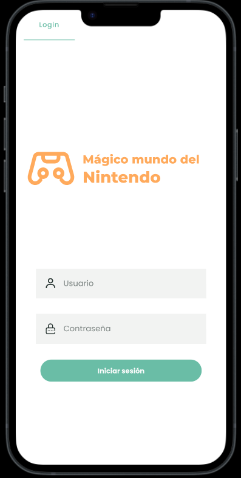
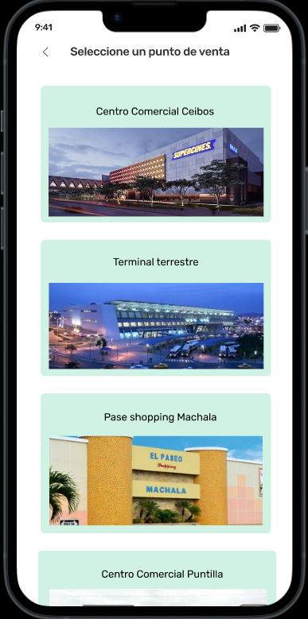
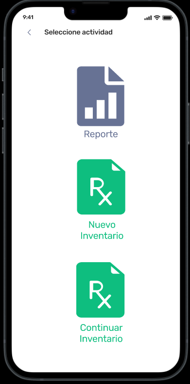
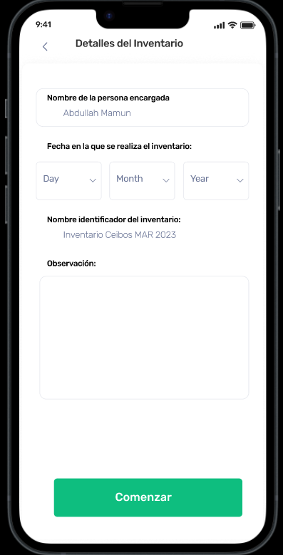
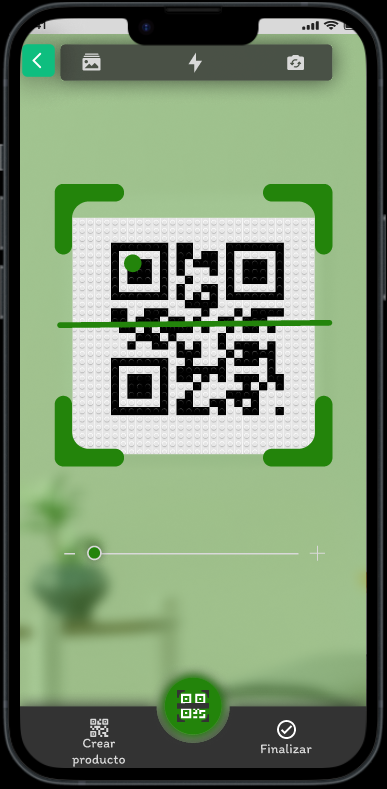
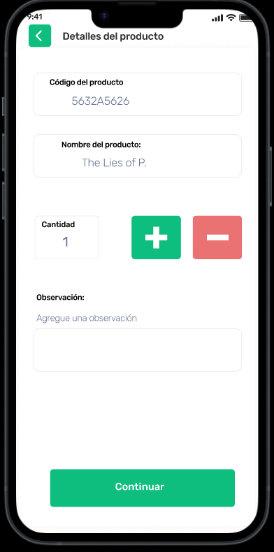
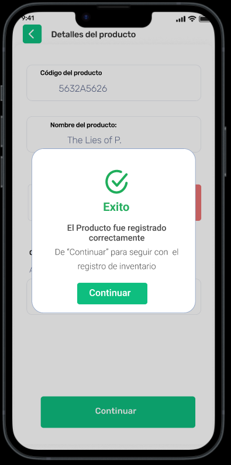
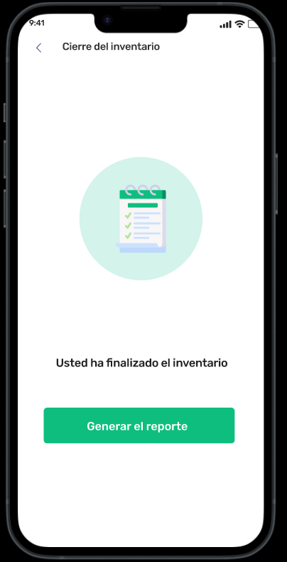
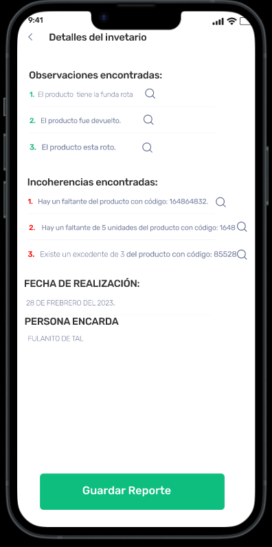
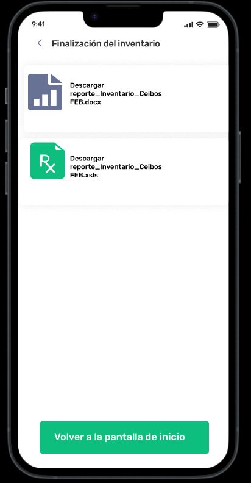

# Requeriments_PRICOTERCORP
In this README.md you will find the evidences, the prototypes and the document of the Software Requirements for PricoTercorp S.A system.
The project name is "Nintventario". You can find the document of the requirements in the files of this respository. \
Only if you want, you can check the LaTeX project [here](https://es.overleaf.com/4254396624vdgszmjpzdtq#e96311) but it is not necessary.

## Contenido
* [Summarize](#summarize)
* [Evidence of lifting the requirements](#evidence-of-lifting-the-requirements)
* [Prototypes](#prototypes)

  

## Summarize
The company ”Pricotercorp S.A.” has a wide variety of items such as video games and
comics, which are currently inventoried in Excel. A software system with two modules
is needed, one exclusively for company workers and the other for customer use.

First, there is an inventory that contains all the details of the products such as stock,
price, name, and code (id) in order to streamline the inventory update process. On the 
other hand, there is a web page that shows all the available products from each store by city;
moreover, customers will be able to view the details of the aforementioned products except 
for the code of each product so that customers can reserve a product of interest.

## Evidence of lifting the requirements

## Prototypes
In this section you will find some screenchots of the prototypes of each module and the links of
the projects in figma.

### Mobile Module
[Click here to go to the prototype in figma.](https://www.figma.com/file/Z7bK7du3JL11GXdjHMKw8e/Aplicaci%C3%B3n-m%C3%B3vil?type=design&mode=design&t=5MIZgLxftGQTU0p4-1) (Not Mandatory!)

### Web Module
[Click here to go to the prototype in figma.](https://www.figma.com/file/6VRYsy5zd0mCjp9DBXiWGH/SITIO-WEB?type=design&node-id=0%3A1&mode=design&t=ZdupB0wBs5cKVbPd-1)(Not Mandatory!)

